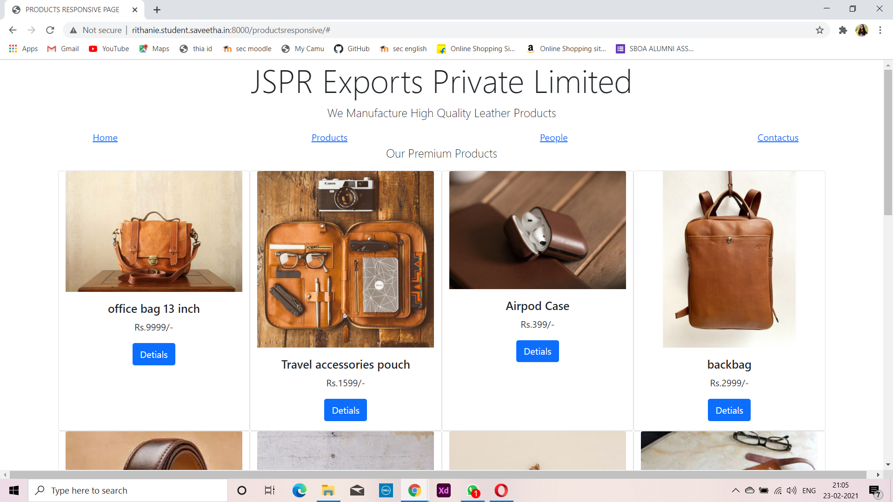
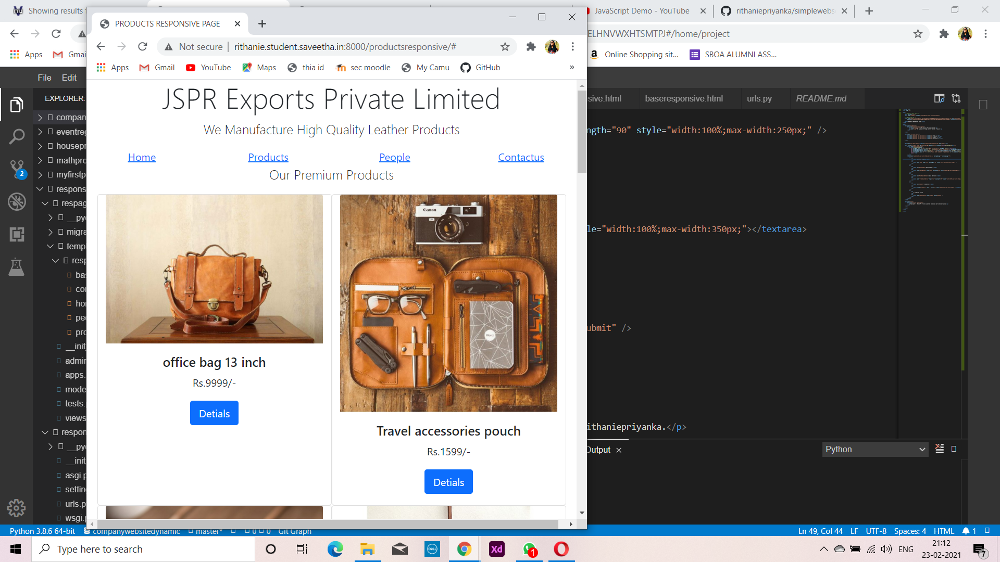

# Design of Responsive Website
## AIM:
To design a responsive website with two break points.

## DESIGN STEPS:
### Step 1: 
Requirement collection.
### Step 2:
Creating the layout using HTML and CSS.
### Step 3:
Updating the sample content.
### Step 4:
Choose the appropriate style and color scheme.
### Step 5:
Validate the layout in various browsers.
### Step 6:
Validate the HTML code.
### Step 7:
Create a database model and migrate the database.
### Step 8:
Retrieve data from database and display it in a dynamic webpage.
### Step 9:
Publish the website in the given URL.

## PROGRAM:
### homeresponsive.html
```
<!doctype html>
<html lang="en">

<head>
    <!-- Required meta tags -->
    <meta charset="utf-8">
    <meta name="viewport" content="width=device-width, initial-scale=1">

    <!-- Bootstrap CSS -->
    <link href="https://cdn.jsdelivr.net/npm/bootstrap@5.0.0-beta1/dist/css/bootstrap.min.css" rel="stylesheet"
        integrity="sha384-giJF6kkoqNQ00vy+HMDP7azOuL0xtbfIcaT9wjKHr8RbDVddVHyTfAAsrekwKmP1" crossorigin="anonymous">

    <title>PRODUCTS RESPONSIVE PAGE</title>
</head>

<body>
    <div class="jumbotron">
        <div class="container text-center">
            <h1 class="display-4">JSPR Exports Private Limited</h1>
            <p class="lead">We Manufacture High Quality Leather Products</p>
        </div>

    </div>

    <div class="row text-center">
        <div class="menuitem col-12 col-md-3"><a href="#">Home</a></div>
        <div class="menuitem col-12 col-md-3"><a href="#">Products</a></div>
        <div class="menuitem col-12 col-md-3"><a href="#">People</a></div>
        <div class="menuitem col-12 col-md-3"><a href="#">Contactus</a></div>

    </div>

    <div class="homecontent text-center">
        <div class="row text-center"></div>
        <h5>Welcome to the home of JSPR Leathers</h5>

        <div class="context">
            We are a manufacturer of premium processed leathers in India. We take great pride in the quality of leather
            that we manufacture, and are proud members of the international Leather Working Group, committed to
            providing excellent quality leathers in the most eco-friendly way possible.
                Our state of the art processing and manufacturing plant features some of the latest technologies in the
                leather industry. We have been fortunate to have hired highly skilled, experienced and innovative
                professionals to drive our company forward. Our employee base is the one asset which keeps us going and
                makes us better every day. Our visionary leaders provide us with the right direction and the motivation
                to achieve our goal of becoming the largest and best leather manufacturing company in India.
                We are also committed to making the world a better place to live in. Through our membership at the
                prestigious Leather Working Group, we have managed to implement environment friendly measures and best
                practices. We use sustainable manufacturing methods, and are honored to be able to do our bit for the
                environment while crafting high-quality leathers that is synonymous with durability and comfort.

            
            <div class="row text-center"></div>
        </div>

    </div>

    <div class="row">
        <div class="col-12 text-center">
            <p>Copyright © 2021 JSPR Private Limited, Developed by Rithaniepriyanka.</p>
        </div>
    </div>


    <!-- Optional JavaScript; choose one of the two! -->

    <!-- Option 1: Bootstrap Bundle with Popper -->
    <script src="https://cdn.jsdelivr.net/npm/bootstrap@5.0.0-beta1/dist/js/bootstrap.bundle.min.js"
        integrity="sha384-ygbV9kiqUc6oa4msXn9868pTtWMgiQaeYH7/t7LECLbyPA2x65Kgf80OJFdroafW"
        crossorigin="anonymous"></script>

    <!-- Option 2: Separate Popper and Bootstrap JS -->
    <!--
    <script src="https://cdn.jsdelivr.net/npm/@popperjs/core@2.5.4/dist/umd/popper.min.js" integrity="sha384-q2kxQ16AaE6UbzuKqyBE9/u/KzioAlnx2maXQHiDX9d4/zp8Ok3f+M7DPm+Ib6IU" crossorigin="anonymous"></script>
    <script src="https://cdn.jsdelivr.net/npm/bootstrap@5.0.0-beta1/dist/js/bootstrap.min.js" integrity="sha384-pQQkAEnwaBkjpqZ8RU1fF1AKtTcHJwFl3pblpTlHXybJjHpMYo79HY3hIi4NKxyj" crossorigin="anonymous"></script>
    -->
</body>

</html>
```

### productresponsive.html
```

<!doctype html>
<html lang="en">

<head>
    <!-- Required meta tags -->
    <meta charset="utf-8">
    <meta name="viewport" content="width=device-width, initial-scale=1">

    <!-- Bootstrap CSS -->
    <link href="https://cdn.jsdelivr.net/npm/bootstrap@5.0.0-beta1/dist/css/bootstrap.min.css" rel="stylesheet"
        integrity="sha384-giJF6kkoqNQ00vy+HMDP7azOuL0xtbfIcaT9wjKHr8RbDVddVHyTfAAsrekwKmP1" crossorigin="anonymous">

    <title>PRODUCTS RESPONSIVE PAGE</title>
</head>

<body>
    <div class="jumbotron">
        <div class="container text-center">
        <h1 class="display-4">JSPR Exports Private Limited</h1>
        <p class="lead">We Manufacture High Quality Leather Products</p>
        </div>

    </div>

    <div class="row text-center">
        <div class="menuitem col-12 col-md-3"><a href="#">Home</a></div>
        <div class="menuitem col-12 col-md-3"><a href="#">Products</a></div>
        <div class="menuitem col-12 col-md-3"><a href="#">People</a></div>
        <div class="menuitem col-12 col-md-3"><a href="#">Contactus</a></div>

    </div>

    <div class="container">

        <div class="row text-center">
            <div class="col-12">
            <p class="lead">Our Premium Products</p>
            </div>
        </div>
        <div class="row text-center">
            <div class="card col-12 col-md-6 col-lg-3 ">
                
                <div class="card-body">
                    <h5 class="card-title">office bag 13 inch</h5>
                    <p class="card-text">Rs.9999/-</p>
                    <a href="#" class="btn btn-primary">Detials</a>
                </div>
            </div>
            <div class="card col-12 col-md-6 col-lg-3 ">
                
                <div class="card-body">
                    <h5 class="card-title">Travel accessories pouch</h5>
                    <p class="card-text">Rs.1599/-</p>
                    <a href="#" class="btn btn-primary">Detials</a>
                </div>
            </div>
            <div class="card col-12 col-md-6 col-lg-3 ">
                
                <div class="card-body">
                    <h5 class="card-title">Airpod Case</h5>
                    <p class="card-text">Rs.399/-</p>
                    <a href="#" class="btn btn-primary">Detials</a>
                </div>
            </div>
            <div class="card col-12 col-md-6 col-lg-3 ">
                
                <div class="card-body">
                    <h5 class="card-title">backbag</h5>
                    <p class="card-text">Rs.2999/-</p>
                    <a href="#" class="btn btn-primary">Detials</a>
                </div>
            </div>
            <div class="card col-12 col-md-6 col-lg-3">
                
                <div class="card-body">
                    <h5 class="card-title">belt</h5>
                    <p class="card-text">Rs.1700/-</p>
                    <a href="#" class="btn btn-primary">Detials</a>
                </div>
            </div>
            <div class="card col-12 col-md-6 col-lg-3">
                
                <div class="card-body">
                    <h5 class="card-title">wood customised chair</h5>
                    <p class="card-text">Rs.4900/-</p>
                    <a href="#" class="btn btn-primary">Detials</a>
                </div>
            </div>
            <div class="card col-12 col-md-6 col-lg-3">
                
                <div class="card-body">
                    <h5 class="card-title">cooler Pouch</h5>
                    <p class="card-text">Rs.750/-</p>
                    <a href="#" class="btn btn-primary">Detials</a>
                </div>
            </div>
            <div class="card col-12 col-md-6 col-lg-3 ">
                
                <div class="card-body">
                    <h5 class="card-title">Pen Pouch</h5>
                    <p class="card-text">Rs.1300/-</p>
                    <a href="#" class="btn btn-primary">Detials</a>
                </div>
            </div>
            <div class="card col-12 col-md-6 col-lg-3">
                
                <div class="card-body">
                    <h5 class="card-title">customised sling bag</h5>
                    <p class="card-text">Rs.12000/-</p>
                    <a href="#" class="btn btn-primary">Detials</a>
                </div>
            </div>
            <div class="card col-12 col-md-6 col-lg-3">
                
                <div class="card-body">
                    <h5 class="card-title">women slippers</h5>
                    <p class="card-text">Rs.3570/-</p>
                    <a href="#" class="btn btn-primary">Detials</a>
                </div>
            </div>
            <div class="card col-12 col-md-6 col-lg-3">
                
                <div class="card-body">
                    <h5 class="card-title">Travel bag</h5>
                    <p class="card-text">Rs.6500/-</p>
                    <a href="#" class="btn btn-primary">Detials</a>
                </div>
            </div>
            <div class="card col-12 col-md-6 col-lg-3">
                
                <div class="card-body">
                    <h5 class="card-title">mens wallet</h5>
                    <p class="card-text">Rs.2700/-</p>
                    <a href="#" class="btn btn-primary">Detials</a>
                </div>
            </div>
        </div>
        <div class="row">
            <div class="col-12 text-center">
                <p>Copyright © 2021 JSPR Private Limited, Developed by Rithaniepriyanka.</p>
            </div>
        </div>

    </div>

    <!-- Optional JavaScript; choose one of the two! -->

    <!-- Option 1: Bootstrap Bundle with Popper -->
    <script src="https://cdn.jsdelivr.net/npm/bootstrap@5.0.0-beta1/dist/js/bootstrap.bundle.min.js"
        integrity="sha384-ygbV9kiqUc6oa4msXn9868pTtWMgiQaeYH7/t7LECLbyPA2x65Kgf80OJFdroafW"
        crossorigin="anonymous"></script>

    <!-- Option 2: Separate Popper and Bootstrap JS -->
    <!--
    <script src="https://cdn.jsdelivr.net/npm/@popperjs/core@2.5.4/dist/umd/popper.min.js" integrity="sha384-q2kxQ16AaE6UbzuKqyBE9/u/KzioAlnx2maXQHiDX9d4/zp8Ok3f+M7DPm+Ib6IU" crossorigin="anonymous"></script>
    <script src="https://cdn.jsdelivr.net/npm/bootstrap@5.0.0-beta1/dist/js/bootstrap.min.js" integrity="sha384-pQQkAEnwaBkjpqZ8RU1fF1AKtTcHJwFl3pblpTlHXybJjHpMYo79HY3hIi4NKxyj" crossorigin="anonymous"></script>
    -->
</body>

</html>
```

### peopleresponsive.html
```

<!doctype html>
<html lang="en">

<head>
    <!-- Required meta tags -->
    <meta charset="utf-8">
    <meta name="viewport" content="width=device-width, initial-scale=1">

    <!-- Bootstrap CSS -->
    <link href="https://cdn.jsdelivr.net/npm/bootstrap@5.0.0-beta1/dist/css/bootstrap.min.css" rel="stylesheet"
        integrity="sha384-giJF6kkoqNQ00vy+HMDP7azOuL0xtbfIcaT9wjKHr8RbDVddVHyTfAAsrekwKmP1" crossorigin="anonymous">

    <title>PRODUCTS RESPONSIVE PAGE</title>
</head>

<body>
    <div class="jumbotron">
        <div class="container text-center">
        <h1 class="display-4">JSPR Exports Private Limited</h1>
        <p class="lead">We Manufacture High Quality Leather Products</p>
        </div>

    </div>

    <div class="row text-center">
        <div class="menuitem col-12 col-md-3"><a href="#">Home</a></div>
        <div class="menuitem col-12 col-md-3"><a href="#">Products</a></div>
        <div class="menuitem col-12 col-md-3"><a href="#">People</a></div>
        <div class="menuitem col-12 col-md-3"><a href="#">Contactus</a></div>

    </div>


        <div class="row text-center">
            <div class="col-12">
            <p class="lead">Our Team</p>
            </div>
        </div>
        <div class="row text-center">
            <div class="card col-12 col-md-6 col-lg-3 ">
                
                <div class="card-body">
                    <h5 class="card-title">Rithaniepriyanka</h5>
                    <p class="card-text">chairman</p>
                    <a href="#" class="btn btn-primary">about</a>
                </div>
            </div>
            <div class="card col-12 col-md-6 col-lg-3 ">
                
                <div class="card-body">
                    <h5 class="card-title">Aishwarryaa</h5>
                    <p class="card-text">Team Leader</p>
                    <a href="#" class="btn btn-primary">about</a>
                </div>
            </div>
            <div class="card col-12 col-md-6 col-lg-3 ">
                
                <div class="card-body">
                    <h5 class="card-title">Prawinraghav</h5>
                    <p class="card-text">Team Leader</p>
                    <a href="#" class="btn btn-primary">about</a>
                </div>
            </div>
            <div class="card col-12 col-md-6 col-lg-3 ">
                
                <div class="card-body">
                    <h5 class="card-title">Prithvi Raj</h5>
                    <p class="card-text">Team Leader</p>
                    <a href="#" class="btn btn-primary">about</a>
                </div>
            </div>
            <div class="card col-12 col-md-6 col-lg-3">
                
                <div class="card-body">
                    <h5 class="card-title">Raj Ashwin</h5>
                    <p class="card-text">Team Leader</p>
                    <a href="#" class="btn btn-primary">about</a>
                </div>
            </div>
            <div class="card col-12 col-md-6 col-lg-3">
                
                <div class="card-body">
                    <h5 class="card-title">Manoj Raj</h5>
                    <p class="card-text">Team Leader</p>
                    <a href="#" class="btn btn-primary">about</a>
                </div>
            </div>
        </div>
        <div class="row">
            <div class="col-12 text-center">
                <p>Copyright © 2021 JSPR Private Limited, Developed by Rithaniepriyanka.</p>
            </div>
        </div>

    

    <!-- Optional JavaScript; choose one of the two! -->

    <!-- Option 1: Bootstrap Bundle with Popper -->
    <script src="https://cdn.jsdelivr.net/npm/bootstrap@5.0.0-beta1/dist/js/bootstrap.bundle.min.js"
        integrity="sha384-ygbV9kiqUc6oa4msXn9868pTtWMgiQaeYH7/t7LECLbyPA2x65Kgf80OJFdroafW"
        crossorigin="anonymous"></script>

    <!-- Option 2: Separate Popper and Bootstrap JS -->
    <!--
    <script src="https://cdn.jsdelivr.net/npm/@popperjs/core@2.5.4/dist/umd/popper.min.js" integrity="sha384-q2kxQ16AaE6UbzuKqyBE9/u/KzioAlnx2maXQHiDX9d4/zp8Ok3f+M7DPm+Ib6IU" crossorigin="anonymous"></script>
    <script src="https://cdn.jsdelivr.net/npm/bootstrap@5.0.0-beta1/dist/js/bootstrap.min.js" integrity="sha384-pQQkAEnwaBkjpqZ8RU1fF1AKtTcHJwFl3pblpTlHXybJjHpMYo79HY3hIi4NKxyj" crossorigin="anonymous"></script>
    -->
</body>

</html>
```

### contactusresponsive
```
<!doctype html>
<html lang="en">

<head>
    <!-- Required meta tags -->
    <meta charset="utf-8">
    <meta name="viewport" content="width=device-width, initial-scale=1">

    <!-- Bootstrap CSS -->
    <link href="https://cdn.jsdelivr.net/npm/bootstrap@5.0.0-beta1/dist/css/bootstrap.min.css" rel="stylesheet"
        integrity="sha384-giJF6kkoqNQ00vy+HMDP7azOuL0xtbfIcaT9wjKHr8RbDVddVHyTfAAsrekwKmP1" crossorigin="anonymous">

    <title>PRODUCTS RESPONSIVE PAGE</title>
</head>

<body>
    <div class="jumbotron">
        <div class="container text-center">
            <h1 class="display-4">JSPR Exports Private Limited</h1>
            <p class="lead">We Manufacture High Quality Leather Products</p>
        </div>

    </div>

    <div class="row text-center">
        <div class="menuitem col-12 col-md-3"><a href="#">Home</a></div>
        <div class="menuitem col-12 col-md-3"><a href="#">Products</a></div>
        <div class="menuitem col-12 col-md-3"><a href="#">People</a></div>
        <div class="menuitem col-12 col-md-3"><a href="#">Contactus</a></div>

    </div>


    <div class="row text-center"></div>

    <form action="//submit.form" id="ContactUs100" method="post" onsubmit="return ValidateForm(this);">
        <script type="text/javascript">
            function ValidateForm(frm) {
                if (frm.Name.value == "") { alert('Name is required.'); frm.Name.focus(); return false; }
                if (frm.FromEmailAddress.value == "") { alert('Email address is required.'); frm.FromEmailAddress.focus(); return false; }
                if (frm.FromEmailAddress.value.indexOf("@") < 1 || frm.FromEmailAddress.value.indexOf(".") < 1) { alert('Please enter a valid email address.'); frm.FromEmailAddress.focus(); return false; }
                if (frm.Comments.value == "") { alert('Please enter comments or questions.'); frm.Comments.focus(); return false; }
                return true;
            }
        </script>
        <table style="width:100%;max-width:550px;border:0;" cellpadding="8" cellspacing="0">
            <tr>
                <td>
                    <label for="Name">Name*:</label>
                </td>
                <td>
                    <input name="Name" type="text" maxlength="60" style="width:100%;max-width:250px;" />
                </td>
            </tr>
            <tr>
                <td>
                    <label for="PhoneNumber">Phone number:</label>
                </td>
                <td>
                    <input name="PhoneNumber" type="text" maxlength="43" style="width:100%;max-width:250px;" />
                </td>
            </tr>
            <tr>
                <td>
                    <label for="FromEmailAddress">Email address*:</label>
                </td>
                <td>
                    <input name="FromEmailAddress" type="text" maxlength="90" style="width:100%;max-width:250px;" />
                </td>
            </tr>
            <tr>
                <td>
                    <label for="Comments">Comments*:</label>
                </td>
                <td>
                    <textarea name="Comments" rows="7" cols="40" style="width:100%;max-width:350px;"></textarea>
                </td>
            </tr>
            <tr>
                <td>
                    * - required fields
                </td>
                <td>
                    <input name="skip_Submit" type="submit" value="Submit" />
                </td>
            </tr>
        </table>
    </form>

    <div class="row">
        <div class="col-12 text-center">
            <p>Copyright © 2021 JSPR Private Limited, Developed by Rithaniepriyanka.</p>
        </div>
    </div>

    </div>
</body>

</html>
```
## OUTPUT:

### large size




### medium size



### phone size


### validation report


## RESULT:
Thus, a responsive website with two break points is designed and is hosted in the URL 
"http://safa.student.saveetha.in:8000/homeresponsive/"